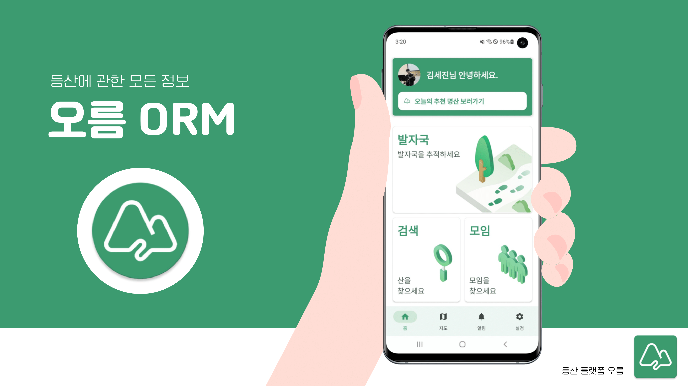
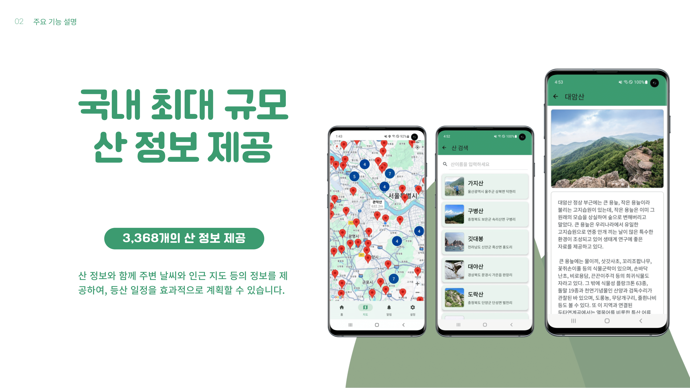
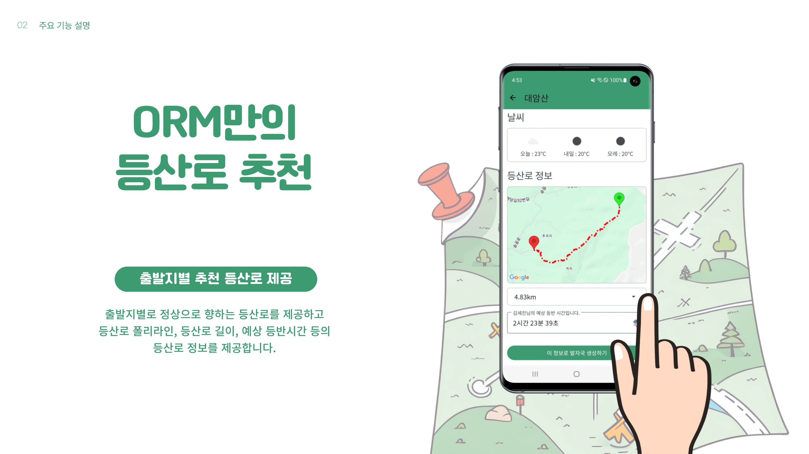
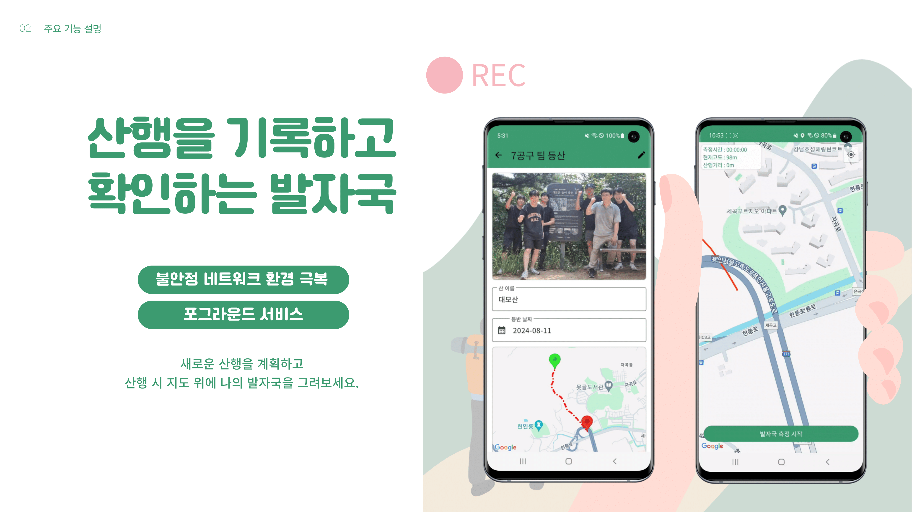
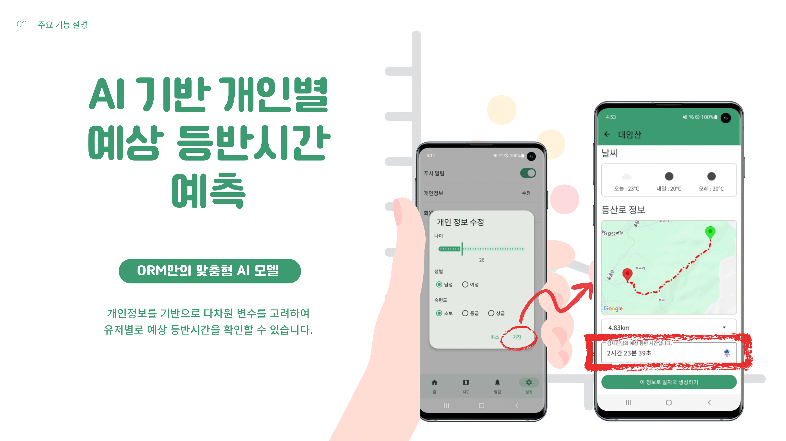
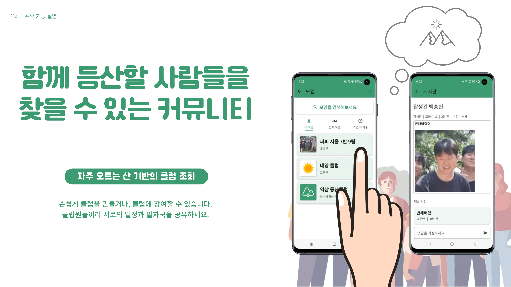
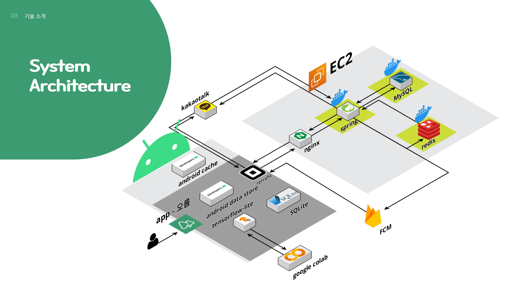

# 🏔 오름(ORM)

**등산과 친해지고 싶은 사람들을 위한 통합 플랫폼**

자신만의 등산 일지를 기록하고 공유하며, 함께할 친구를 찾아보세요!

-  [Figma](https://www.figma.com/design/hqzvkj4XuLN4beGzodbbyt/%ED%94%8C%EB%A1%9C%EC%9A%B0-%EC%B0%A8%ED%8A%B8?node-id=0-1&t=n5dcGHgkT1Ca87Qc-0)
-  [Notion](https://yuihirasawa.notion.site/7-9-PJT-1d1ef668e018444ebd7513cbde3f4029?pvs=4)

## 👯‍♂️ Members

- #### android

|                                         [백승헌](https://github.com/elic121)                                         |                                       [김세진](https://github.com/K-sejin)                                        |                                      [송주한](https://github.com/SongJH97)                                      |
| :------------------------------------------------------------------------------------------------------------------: | :---------------------------------------------------------------------------------------------------------------: | :-------------------------------------------------------------------------------------------------------------: |
|                                          |                                      |                                     |
| 
<ul><li>서비스 아키텍처 설계</li><li>GPS 포그라운드 서비스 구현</li><li>UI/UX 총괄</li></ul>
 | 
<ul><li>UI 개발 및 아키텍처 구성</li><li>AI 모델 설계</li><li>A\* 알고리즘 설계</li></ul>
 | 
<ul><li>UI 개발 및 아키텍처 구성</li><li>모임 게시판 구현</li><li>날씨UI 구현</li></ul>
 |

- #### backend

|                               [손준범](https://github.com/junbeom-Son)                               |                      [이찬진](https://github.com/jinchandol)                      |                                [김주형](https://github.com/j00boy)                                |
| :--------------------------------------------------------------------------------------------------: | :-------------------------------------------------------------------------------: | :-----------------------------------------------------------------------------------------------: |
|                          |      |                      |
| 
<ul><li>FCM 푸쉬 알람</li><li>캐시 서버 구현</li><li>카카오 로그인</li></ul>
 | 
<ul><li>ERD 설계</li><li>CI/CD</li><li>API 구현</li></ul>
 | 
<ul><li>ERD 설계</li><li>API 구현</li><li>데이터 전처리 및 연동</li></ul>
 |

### 🌟 Special Thanks With Design 🌟

| <h3 align="center">[✨ yuuuuuuujin ✨](https://github.com/yuuuuuuujin)</h3> |
|:--:|
|  |
| 
<ul><li>프로젝트 로고 디자인</li><li>UI 디자인 지원</li></ul>
 |

## 🔍 주요 기능

### 1. 국내 최대 규모 산 정보 제공

국내 소재 **3,368개**의 산에 대한 정보를 제공합니다.  
주변 날씨와 인근 지도 등의 정보를 포함하여, 등산 일정을 효과적으로 계획할 수 있습니다.

### 2. 오름만의 등산로 추천

출발지별로 정상으로 향하는 **등산로**를 제공합니다.  
등산로 폴리라인, 등산로 길이, 예상 등반 시간 등 유용한 정보를 제공합니다.

### 3. 산행을 계획, 기록, 확인하는 발자국 기능

**불안정한 네트워크** 환경에서도 문제없이 작동합니다.  
새로운 산행을 계획하고, 지도 위에 나만의 발자국을 그릴 수 있습니다.

### 4. AI 기반 개인별 예상 등반시간 예측

개인정보를 기반으로 다차원 변수를 고려한 **AI**가  
유저별로 **예상 등반 시간**을 정확하게 예측해 줍니다.

### 5. 함께 등산할 사람들을 찾을 수 있는 커뮤니티 기능

손쉽게 클럽을 만들거나, 클럽에 참여할 수 있습니다.  
클럽원들끼리 서로의 일정과 발자국을 공유하며,  
**게시판**을 통해 서로의 관심사도 공유할 수 있습니다.

## ⚙ System Architecture

